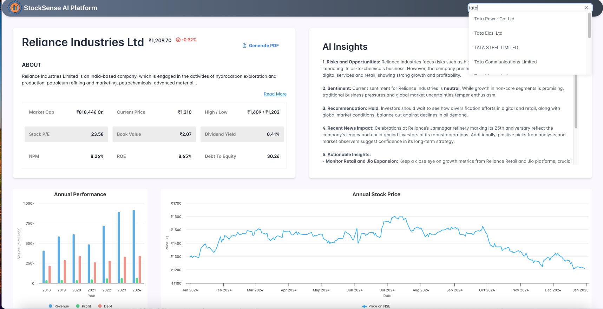
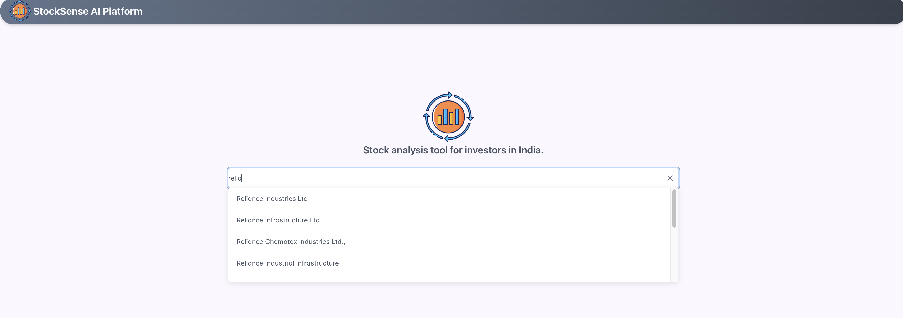

# StockSense AI Platform

## Overview
The **StockSense AI Platform** is an Angular-based application that provides real-time stock market analysis. It allows users to search for a company's stock by entering the stock name or ticker symbol and displays the stock's current performance along with AI-generated insights.

The platform includes a **dashboard** with key financial metrics, stock price charts, and actionable insights. It also offers a **search bar** for quickly finding companies and viewing their stock data.

### Key Features:
- **Search bar**: Search for companies by stock name or ticker symbol.
- **Stock Dashboard**: View real-time stock data, including market cap, current price, stock P/E ratio, dividend yield, and more.
- **AI Insights**: Get AI-driven analysis of stock risks, opportunities, sentiment, and recommendations.
- **Annual Performance Charts**: View revenue, profit, and debt trends over multiple years.
- **Annual Stock Price Charts**: Track the price trends of stocks over time.
- **PDF Reports**: Generate detailed PDF reports for stocks, including key metrics and insights.

## Screenshots
Here are some screenshots of the StockSense AI Platform:

1. **Stock Dashboard**:
   

2. **Home Page**:
   

## Technologies Used:
- **Angular**: Frontend framework for building the UI.
- **Highcharts**: For visualizing stock performance and financial data.
- **Tailwind CSS**: For utility-first styling and responsive design.
- **PrimeNG**: UI component library for Angular.
- **RxJS**: For handling asynchronous data streams.
- **Jest**: For testing the components and services.

## Installation

### Prerequisites:
- Node.js (v18.19.0 or later)
- npm (v10.5.2 or later)

### Setup:
1. Clone the repository:
    ```bash
    git clone https://github.com/lodhaneha7/stocksense-ai-frontend.git
    ```
   
2. Navigate to the project directory:
    ```bash
    cd stocksense-ai-frontend
    ```

3. Install dependencies:
    ```bash
    npm install
    ```

4. Start the development server:
    ```bash
    npm run start
    ```
   The application will be available at `http://localhost:4200`.

## Usage
- **Search for companies**: Enter the stock name or ticker symbol in the search bar to retrieve real-time stock data.
- **View stock details**: After searching, the dashboard will display key financial metrics, annual performance, stock price trends, and AI insights.
- **Generate Reports**: Use the "Generate PDF" button to download stock reports.

## Project Structure
- **src/app**: Contains the main Angular application logic, including components and services.
- **src/app/services**: Contains services for interacting with APIs to fetch stock data and AI insights.
- **src/app/components**: Contains reusable components such as company details, financial charts, and stock price charts.
- **src/environments**: Contains environment configuration for development and production.

## Running Tests
To run tests with Jest, use the following command:
```bash
npm run test
```


## Stay in touch

- Author - [Neha Lodha](https://www.linkedin.com/in/neha-lodha-507618157/)

### Key points in this `README.md`:
- The **StockSense AI Platform** backend details are mentioned.
- **Backend** of this project is linked as the GitHub repository [StockSense AI Backend](https://github.com/lodhaneha7/stocksense-ai-backend) , where users can refer to the backend part of the project.
